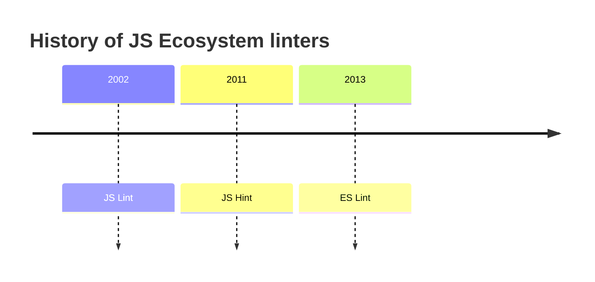

## ESLint - More Than Just Extend

In the world of software development, we often find ourselves spending an inordinate amount of time on code reviews. This perfectionism leads us to scrutinize even the smallest details, occasionally sparking disputes that can disrupt our teams. Surprisingly, this all transpires in an area where we have all the tools to automate these processes and eliminate unnecessary conflicts. The root of the problem? Our interaction with `ESLint` is often limited to merely extending a configuration from a popular setup. Don't get me wrong; this is a fine starting point, but the issue lies in these configurations covering only a fraction of what `ESLint` can truly accomplish.

## The Prehistory of ESLint

Before we delve further into the intricacies of `ESLint`, let's take a moment to revisit its history. `ESLint` is a software tool that performs static analysis on code, seeking out bugs, unused code, syntax errors/typos, and enforcing code style, among other things. The term "linting" originated from a software tool [Lint](<https://en.wikipedia.org/wiki/Lint_(software)>) used for static analysis in the C language. In the early 21st century, this term became commonplace across the software development industry.



- In 2002, Douglas Crockford introduced the first linting instrument called [JSLint](https://www.jslint.com/) It was a self-opinionated tool, and whether you liked it or not, you had little room for customization.

- In 2011, Anton Kovalyov forked JS Lint to create [JS Hint](https://jshint.com/docs/). The key difference with `JSHint` was that it allowed you to customize rules to suit your preferences.

- In 2013, Nickolas Zachard, one of the contributors to `JSHint`, took the concept further by creating `ES Lint`. The motivation behind ES Lint was to empower developers to create their own rules and reuse them in a configuration.

## Mastering ESLint Configuration: A Strategic Approach

So, how do we go about creating a configuration for `ESLint`, and what do we need for it? The process involves reading documentation, setting up, and tweaking over 200 `ESLint` rules. However, you don't need to configure all of them, as it may not align with your expectations or coding style. Each rule you adjust demands an investment of your time and also impacts your CPU usage every time `ESLint` runs. Fortunately, there are numerous time-saving features at your disposal.

For instance, consider the scenario where your `ESLint` configuration extends "airbnb" or "recommended." How can you determine which rules are enabled or disabled within these configurations? The solution is simple: run the following command:

```sh
eslint --print-config .eslintrc > output.json
```

This command generates a JSON file containing all the configurations that `ESLint` uses. The only exceptions are the rules specified in the overrides field, which we'll revisit shortly.

```json
{
  "env": {
    "browser": true,
    "es2021": true
  },
  "globals": {},
  "parser": null,
  "parserOptions": {
    "ecmaVersion": "latest"
  },
  "plugins": [
    "yml",
    "html"
  ],
  "rules": {
    "indent": [
      "error",
      2
    ],
    "linebreak-style": [
      "error",
      "unix"
    ],
  ...
}
```

## Extending Rules

When it comes to extending rules, it's crucial to understand precisely what you're inheriting. Not all rules are as straightforward as toggling them on or off. Take, for example, the `"indent"` rule:

```json
"rules": {
    "indent": [
      "error",
      2,
      {
        "SwitchCase": 1,
        "ArrayExpression": 1,
        "ObjectExpression": 1,
        "ImportDeclaration": 1,
        "CallExpression": {
          "arguments": "first"
        },
        "flatTernaryExpressions": false,
        "offsetTernaryExpressions": false,
        "ignoreComments": false
      },
    ...
    ]
  ...
}
```

Often, it is more practical to reuse an existing solution rather than reinvent the wheel. Thankfully, there is an abundance of open-source plugins available, allowing us to pick and choose the ones that suit our needs.

## Useful ESLint Plugins

Here are some useful `ESLint` plugins that can enhance your code quality and development process:

- [eslint-plugin-sonarjs](https://www.npmjs.com/package/eslint-plugin-sonarjs){:target="\_blank"}: This plugin utilizes SonarJS rules for `ESLint` to detect bugs and suspicious patterns in your code.

Let's review a code sample:

```js
function calculateFactorial(number) {
  if (number < 0) {
    return "Invalid input"; // This is a code smell
  }

  let factorial = 1;
  for (let i = 1; i <= number; i++) {
    factorial *= i;
  }

  return factorial;
}
```

When you run `ESLint`, you may encounter an error message like this:

> "Refactor this code to not use a return statement inside a loop or if/else statement."

- [eslint-plugin-optimize-regex](https://www.npmjs.com/package/eslint-plugin-optimize-regex){:target="\_blank"}: This plugin is handy for optimizing regular expressions in your code. Let's consider a simple JavaScript function that validates email addresses using a regular expression:

```js
function validateEmail(email) {
  const regex = /^[\w-]+(\.[\w-]+)*@[\w-]+(\.[\w-]+)+$/;
  return regex.test(email);
}
```

This regular expression can be optimized for better performance. Running `ESLint` with the eslint-plugin-optimize-regex might yield an error message like:

> "Regular expression can be optimized."

- [eslint-plugin-import](https://www.npmjs.com/package/eslint-plugin-import){:target="\_blank"}: This plugin supports linting of ES2015+ (ES6+) import/export syntax, preventing issues with misspelled file paths and import names.

- [eslint-import-resolver-typescript](https://www.npmjs.com/package/eslint-import-resolver-typescript){:target="\_blank"}: If you're using TypeScript, this plugin adds TypeScript support to `ESLint` import resolution.

```json
{
  "settings": {
    "import/resolver": {
      "webpack": {
        "config": "./webpack/config.js"
      }
    }
  }
}
```

- [eslint-import-resolver-webpack](https://www.npmjs.com/package/eslint-import-resolver-webpack){:target="\_blank"}: If you're working with Webpack, this plugin can be a valuable addition to your `ESLint` setup.

- [eslint-import-resolver-alias](https://www.npmjs.com/package/eslint-import-resolver-alias){:target="\_blank"}: This plugin is useful if you're using something other than Webpack, like [rollup.js](https://rollupjs.org/){:target="\_blank"}

- [@babel/eslint-plugin](https://www.npmjs.com/package/@babel/eslint-plugin){:target="\_blank"} and [@typescript-eslint/eslint-plugin](https://www.npmjs.com/package/@typescript-eslint/eslint-plugin){:target="\_blank"}: These plugins can override `ESLint` rules with their own for Babel and TypeScript projects, respectively.

## ESLint for Testing

If you use **Jest** for unit or integration tests, there are excellent ESLint plugins available that can help you adhere to best practices:

- [eslint-plugin-jest](https://www.npmjs.com/package/eslint-plugin-jest){:target="\_blank"}: This plugin provides ESLint rules specifically tailored for Jest, ensuring that your test code follows recommended patterns and maintains consistency.

- [eslint-plugin-jest-dom](https://www.npmjs.com/package/eslint-plugin-jest-dom){:target="\_blank"}: If you're using Jest along with the [@testing-library/dom](https://www.npmjs.com/package/@testing-library/dom){:target="\_blank"} library, this plugin helps you write cleaner and more effective assertions for DOM testing.

- [eslint-plugin-testing-library](https://www.npmjs.com/package/eslint-plugin-testing-library){:target="\_blank"}: When you use testing libraries like [@testing-library/react](https://www.npmjs.com/package/@testing-library/react){:target="\_blank"} or [@testing-library/vue](https://www.npmjs.com/package/@testing-library/vue), this plugin assists in writing tests that focus on user behavior rather than implementation details.

## Finding the Right Plugins

With a multitude of ESLint plugins available, it's essential to know where to look when you have specific needs. A fantastic resource for discovering ESLint plugins and configurations is the [awesome-eslint](https://github.com/dustinspecker/awesome-eslint){:target="\_blank"} repository. It serves as a comprehensive catalog of ESLint extensions and tools, making it easy to find the ones that best fit your project's requirements.

However, it's crucial to approach plugin selection with care. While having an abundance of plugins at your disposal can be enticing, it's essential to evaluate their necessity for your project. Adding too many plugins can lead to longer CI/CD pipelines and increased complexity. It's important to strike a balance between utilizing useful plugins and avoiding unnecessary bloat.

## Strategic Considerations Before Adding Project Plugins

Before you dive into adding all these plugins to your project, keep a few things in mind. While these plugins can be powerful, it's essential to exercise caution and avoid blindly importing every available tool. The more plugins you introduce, the longer your Continuous Integration/Continuous Deployment (CI/CD) pipelines may become. If your pipelines don't allow for immediate rollbacks in the event of a production bug and require re-running the entire process, it can be detrimental.

## Measuring ESLint Performance

Before optimizing `ESLint`, it's a good practice to measure how long it takes to run linting in your project. This can help you identify which rules or plugins are causing performance bottlenecks. Here's how to do it:

For **Linux** and **macOS**:

```sh
time npm run lint
```

For **Windows**:

```powershell
Measure-Command { npm run lint }
```

By setting the timing flag to 1, you can pinpoint which rules are the most time-consuming:

```sh
TIMING=1 npm run lint

# Rule                   | Time (ms) | Relative
# :----------------------|----------:|--------:
# No Unused Variables    |      1234 |     20%
# Max Line Length        |       567 |      9%
# No Console Logs        |       789 |     13%
# Indentation            |      2345 |     38%
# No Unused Imports      |       987 |     16%

```

This command provides insights into the `ESLint` rules that take the longest to execute, helping you identify areas for optimization.

## Optimization Strategies

To optimize your `ESLint` setup, consider the following strategies:

1. Update the entire plugin/config to the latest versions.
2. Check for open issues related to specific rules or plugins.
3. Disable rules that aren't crucial for your project.
4. Utilize [overrides](https://eslint.org/docs/latest/use/configure/configuration-files){:target="\_blank"} to fine-tune rules for specific parts of your codebase.

## Prettier Integration

You can further enhance `ESLint` performance by integrating it with [Prettier](https://prettier.io/docs/en/integrating-with-linters.html){:target="\_blank"}, a code formatter. This integration helps by disabling `ESLint` rules related to code formatting, allowing `Prettier` to handle this aspect.

Once you've consolidated your `ESLint` configuration, consider publishing it to npm to make it reusable across various repositories. This way, your dependencies are locked in, reducing the chances of unexpected issues cropping up.

## Integrating ESLint into Your Workflow

After assembling your `ESLint` configuration and installing the necessary plugins, it's crucial to integrate `ESLint` into your existing repository. Running `ESLint` with the `--fix` option can automatically correct many issues, saving you valuable time and ensuring your code adheres to the defined standards.

Moreover, you can integrate `ESLint` with your preferred Integrated Development Environment (IDE), such as [VSCode](https://marketplace.visualstudio.com/items?itemName=dbaeumer.vscode-eslint){:target="\_blank"} or [WebStorm](https://www.jetbrains.com/help/webstorm/eslint.html){:target="\_blank"}. These integrations allow you to apply automated code formatting and linting directly within your coding environment.

## The Path to Code Quality

In conclusion, `ESLint` is a powerful tool that can save you time and effort by automating code quality checks and enforcing consistent coding standards. However, it's essential to approach `ESLint` configurations and plugins with care, selecting only those that align with your project's needs. By optimizing your `ESLint` setup, measuring performance, and integrating it into your workflow, you can strike a balance between code quality and development efficiency.

Remember, the ultimate goal is not just to write code but to write clean, readable, and maintainable code that benefits your team and your projects.
