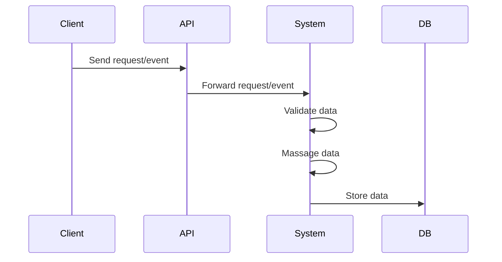
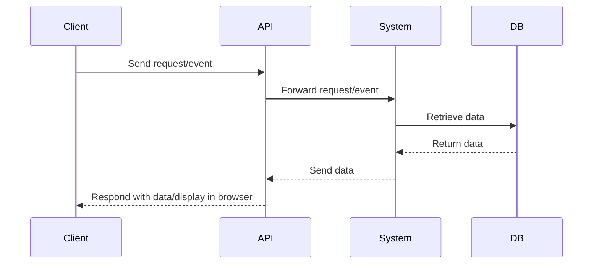

## Transitioning from Monolithic to Microservices

In today's fast-paced world of software development, flexibility and scalability are absolutely crucial. Picture the transformation of a large, cumbersome monolithic system into a fleet of agile, efficient microservices - it's like to witnessing a massive ship morph into a group of swift, nimble speedboats. Throughout my career as a software engineer, I've navigated this journey numerous times.

Transitioning to microservices isn't merely about restructuring - it's a complete rethinking of software design, utilizing tools that were unimaginable just a decade ago. Today, we harness a dynamic ecosystem of technologies that not only make this transition possible but also incredibly rewarding.

## Leveraging the Modern Node.js Ecosystem

### TypeScript for Type Safety and Modern JavaScript

We're currently in a golden age of backend development, especially within the powerful `Node.js` ecosystem. This vibrant landscape offers an arsenal of tools that are reshaping how we build scalable and efficient applications.

`TypeScript` is a standout, offering robust type safety alongside the latest `JavaScript` features, ensuring our code is both reliable and maintainable. `Express` remains a favorite for its speed and minimalist approach to web frameworks, making it perfect for rapid development cycles. Meanwhile, [NestJS](https://nestjs.com/) is becoming the go-to for building scalable and maintainable server-side applications, thanks to its powerful out-of-the-box solutions and modular architecture.

### Domain-Driven Design for Complex Business Logic

For handling complex business logic, `Domain-Driven Design (DDD)` is indispensable. It helps us create software that aligns closely with business needs, reducing the gap between the problem domain and the solution. Clean and `Hexagonal Architecture` principles further refine this approach by clearly separating business logic from infrastructure concerns, ensuring our systems remain adaptable and resilient to change. And then there's `Backend for Frontend (BFF)`, a pattern that optimizes the interaction between frontend and backend systems, enhancing performance and maintainability.

These tools and architectural patterns empower us to construct resilient applications that can adapt seamlessly to the dynamic demands of today's business landscape.

Imagine a large enterprise project composed of dozens, if not hundreds, of microservices. This scenario is a dream for many developers, promising unparalleled modularity and scalability. But the reality of managing such a system is both thrilling and complex.

## Managing Complex Networking Requirements

The journey begins with the client sending a request to our `Node.js` microservice, which serves as the `Backend for Frontend (BFF)`. From there, `Node.js` orchestrates the retrieval of data from a Java Auth Proxy responsible for managing authorization processes. This Java Auth Proxy then forwards the request to another Java service, which interacts with a PostgreSQL database to fetch the required data.

Despite its apparent simplicity, this process involves a series of interconnected steps and systems.

Each component of this system operates within its specialized domain:

- The Web and `Node.js` (BFF) team focuses on managing frontend interactions and optimizing user experiences.
- The `Java` and `PostgreSQL` team ensures the reliability and integrity of backend processes, handling data retrieval and storage efficiently.

Operating independently, these teams maintain system stability while ensuring smooth integration across the entire platform.

To facilitate communication between these services, intricate networking configurations are essential:

- `NGINX` serves as a reverse proxy, managing traffic between web interfaces and `Node.js` services.
- Additional tools like `HAProxy` are employed to efficiently route requests between various `Java`-based services.

Implementing and managing these networking setups across multiple environments - development, testing, staging, and production - requires meticulous planning and coordination.

{: width="972" height="589" }

Despite the complexity, breaking down monoliths into microservices can lead to a more scalable and maintainable architecture. It's a challenging yet rewarding journey.

Moreover, modern applications often require robust observability and monitoring solutions. For instance, we need to trace requests across the entire application using `Zipkin`, and visualize dashboards with `Grafana`. Event-driven architectures often rely on `Kafka` for subscribing, consuming, producing, and publishing events. To handle logging, search, and analysis, we integrate `Elasticsearch` and `Kibana`. For metrics collection, we use `Prometheus`.

All these components need to be containerized using `Docker`. Managing this intricate setup typically requires entire squads of DevOps professionals to configure and maintain the infrastructure, as well as a dedicated QA team to ensure thorough testing. This is crucial because maintaining proper testing for such a complex architecture can be very challenging.

And let's not forget about time-to-market, which is also a critical factor. With all these layers of complexity, the process can become slow and cumbersome.

{: width="486" height="294" }

But why are we overcomplicating things? Why do we need an army of Ops, DevOps, and QA teams to support and retest all of these components?

### Simplifying the Process with Serverless Architecture

Why endure all this hassle when we can simplify the entire process? The core of what we need is quite straightforward.

Get a request or event from client or API, validate and massage data, and store it in DB:



**Or**:

Get a request or event from client, retrieve data from DB, and respond with the data to API or display it in the browser:



As described above, the core processes are quite simple. While it might be feasible for mature enterprises to have squads of developers, QA, and DevOps teams, what about startups? These complex, resource-intensive setups are often not scalable or affordable for startups striving to compete and be first to market.

Thankfully, the tech world is constantly evolving, with new technologies emerging almost daily. These innovations provide opportunities to bypass complexity and build scalable architectures more efficiently. One such opportunity lies in embracing Serverless architecture and `Lambda` functions.

> If you want to read about migrating from traditional to `serverless architecture`, you can read it here: [Exploring the Transition to Serverless Architecture with AWS](/posts/serverless-transition-exploration-with-aws)
> {: .prompt-tip }

### What Are Lambda Functions?

`Lambda` functions are pieces of code that are invoked by events or triggers and execute a specified task in response to those events. It's as simple as that. They enable you to run code without provisioning or managing servers, which significantly reduces infrastructure complexity and cost.

Here are some of the most popular `serverless` offerings:

- **AWS Lambda** and **AWS Lambda@Edge**
- **Microsoft Azure Functions**
- **Google Cloud Functions**

With `Lambda` functions, you can focus on writing code to handle business logic, while the `serverless` platform takes care of everything else, including scaling, patching, and managing infrastructure. This not only simplifies development but also speeds up time-to-market, making it an ideal solution for startups and enterprises alike.

Serverless architectures enable you to:

- **Respond to events in real-time**
- **Scale automatically based on demand**
- **Pay only for the compute time you use**
- **Eliminate the need for complex infrastructure management**

By leveraging serverless and `Lambda` functions, you can build scalable, cost-effective, and efficient architectures that are ready to meet the demands of today's fast-paced market.

There are many languages available for `Lambda` functions, with the most popular ones being `JavaScript` and `Python`. When you deploy a `Lambda` function, the execution environment provisioned by `AWS Lambda` includes the necessary runtime, libraries, and dependencies to run the function. Once the `Lambda` function completes its execution (or times out), the execution environment may be terminated. Notably, `Node.js` is an excellent choice here due to its relatively quick startup time.

{: width="486" height="294" .w-50 .right}

While microservices are substantial and often complex, `Lambdas` are small and focused, allowing for rapid execution and independent development.

### Decomposing Microservices into Lambdas

Decomposing microservices into numerous small Lambda functions offers several advantages:

- **Independent Modification and Maintenance**: Each Lambda function can be modified and maintained independently by different teams, facilitating better organization and division of labor.
- **Code Reusability**: Lambdas can reuse common code, reducing redundancy and promoting consistency.
- **Independent Testing**: Each Lambda function can be tested independently, simplifying the testing process and enhancing reliability.
- **Independent Deployment**: Lambda functions can be deployed to production independently, enabling faster and more flexible deployment cycles.
- **Independent Logging and Tracing**: Each Lambda function can log and trace its own executions, making it easier to debug and monitor.
- **Isolated Failures**: If a Lambda function fails, it does so independently from other functions, minimizing the impact on the overall system.
- **Focused Log Access**: Logs for each Lambda function are isolated, simplifying the process of navigating and analyzing logs compared to dealing with common logs.

By breaking down monolithic microservices into discrete, manageable Lambda functions, you can achieve greater scalability, maintainability, and efficiency. This approach not only aligns with modern development practices but also empowers teams to innovate and deliver features more rapidly.

Embracing `serverless` architecture with `AWS Lambda` transforms the way we build and deploy applications, making it an ideal choice for both startups and established enterprises seeking agility and cost efficiency.

## Enhancing Security with Lambda

One of the most significant advantages of using `Lambda` functions is the inherent security benefits. Each `Lambda` function operates in an isolated environment, which means that if one function is compromised, the vulnerability cannot spread to other functions. After the `Lambda` function completes execution (or times out), its execution environment is terminated, ensuring a stateless architecture. This isolation guarantees that our microservices are effectively turned into secure, independent functions.

### Using Lambdas in the Context of AWS

Let's explore how Lambda functions are utilized within AWS:

#### Routing with API Gateway

Each `Lambda` function corresponds to a particular route. `API Gateway` acts as a "router" with built-in authorization and authentication middleware. This includes:

- **IAM Permissions**
- **Cognito User Pools**
- **Lambda Authorizers**
- **API Keys**

API Gateway directs requests to the appropriate Lambda functions. For example:

- **Route A** invokes **Lambda Function A** to fetch data from a database.
- **Route B** invokes **Lambda Function B** for a different operation.
- For authorization, a dedicated **Lambda Authorizer** can be used as middleware to authenticate requests.

#### Scaling with SQS and SNS

To ensure scalability, we can integrate `Amazon SQS` (Simple Queue Service). `SQS` allows us to queue jobs that Lambdas will process, fetching data from the database as needed. If we need to subscribe to topics and react to events, we can use `Amazon SNS` (Simple Notification Service) in conjunction with `Lambda`.

## Bringing It All Together

By leveraging `AWS` services, we can transform our microservices architecture into a series of interconnected `Lambda` functions. This setup not only simplifies deployment and maintenance but also enhances security and scalability.

Here's how a typical setup might look:

- **API Gateway** receives a request and routes it to the appropriate Lambda function.
- **Lambda Function** processes the request, possibly fetching data from a database.
- **Lambda Authorizer** ensures that the request is authenticated.
- For tasks that require asynchronous processing, **Amazon SQS** queues the jobs for Lambda functions to handle.
- **Amazon SNS** allows Lambdas to subscribe to topics and react to published events.

By adopting this `serverless architecture`, we achieve a microservices-like environment that is more efficient, scalable, and secure.

`Serverless architecture` with `AWS Lambda` offers a compelling solution for modern application development, allowing teams to focus on delivering value rather than managing infrastructure.

{: width="972" height="589" }

But wait... As we break down our architecture into numerous `Lambda` handlers, we encounter a new challenge: managing an ever-growing number of files with different dependencies and potential cross-dependencies. This can quickly become a chaotic mess, something I've seen many times in my career.

{: width="486" height="294" .w-25 }

To manage this complexity, it's essential to maintain an organized folder structure. This includes separating controllers, jobs, models, and libraries into different directories, similar to any mature framework. A main `serverless.js` file can manage per-domain `*.serverless.js` files to create Lambda functions systematically.

One of the best tools for this purpose is the [Serverless Framework](https://www.serverless.com), an open-source platform that simplifies the deployment and management of serverless applications on various cloud providers. The Serverless ecosystem is rich with plugins that serve a variety of purposes, enhancing functionality and streamlining development.

{: width="486" height="294" .w-25 }
{: width="486" height="294" .w-25 }

## Embracing the Serverless Framework

The `Serverless Framework` is particularly well-suited for managing Lambda functions. It offers several advantages:

- **Simplified Deployment**: The framework automates much of the deployment process, reducing manual setup and configuration.
- **Organized Codebase**: By adhering to a structured folder hierarchy, your codebase remains clean and manageable.
- **Rich Plugin Ecosystem**: The extensive range of plugins available can help with various tasks such as monitoring, security, and optimization.
- **No Need for External Frameworks**: You don't need additional frameworks or routers. Lambda handlers are directly invoked by corresponding HTTP requests, keeping things straightforward.

Using the `Serverless Framework`, we can define our serverless application structure as follows:

- **Controllers**: Handle the incoming requests and orchestrate the logic.
- **Jobs**: Manage background tasks and asynchronous processing.
- **Models**: Define the data structures and interact with the database.
- **Libraries**: Contain reusable code and utilities.

By integrating these components into a well-defined structure, we can maintain clarity and efficiency as our serverless application grows. The Serverless Framework not only consolidates the development process but also ensures that our application remains scalable, maintainable, and easy to navigate.

The `Serverless Framework` allows us to simplify and manage the complexity of serverless applications effectively:

First, it enables us to manage infrastructure seamlessly. With `Serverless Framework`, you can define your Lambda functions, specify their memory allocation, set timeout settings, and configure various other parameters, all within a single YAML file. This means you don't have to manually configure each Lambda function through the AWS console, which saves time and reduces the risk of configuration errors.

Deployment is another area where the `Serverless Framework` shines. You can deploy specific Lambda functions to different environments such as development, staging, and production without affecting other parts of your application. This granular control over deployments ensures that changes can be tested and rolled out incrementally, minimizing downtime and reducing the impact of potential issues.

Starting and shipping code becomes much more automated. The `Serverless Framework` offers a powerful CLI that integrates smoothly into your CI/CD pipeline, allowing for automated deployments. This makes it easier to maintain a rapid development cycle, where new features and bug fixes can be deployed continuously.

The rich ecosystem of plugins is one of the `Serverless Framework's` strongest features. These plugins extend the functionality of the framework, enabling tasks such as monitoring, security, and optimization. With contributions from a vibrant community, you can find plugins for almost any requirement, or even develop your own to fit specific needs. You can explore these plugins here: [Where to start: the most popular Framework plugins](https://www.serverless.com/blog/most-popular-framework-plugins).

## Benefits of Independent Functions

Each `Lambda` function benefits from independent configuration, which allows you to customize each function's settings without impacting others. For example, if one function requires more memory or a longer timeout, you can configure it independently, ensuring optimal performance for different workloads.

Independent deployment is another significant advantage. You can deploy functions separately, which means updating one function does not require redeploying the entire application. This reduces deployment times and allows for faster iterations.

Logging is handled independently as well. Each `Lambda` function has its own logs, which simplifies troubleshooting and monitoring. You don't have to sift through a monolithic log file to find relevant entries, making it easier to maintain and debug your application.

Independent timeout settings ensure that each function has an appropriate execution time limit based on its specific requirements. This prevents long-running functions from affecting the performance of shorter tasks.

Scaling is managed independently, meaning each function can scale according to its own demand. This ensures that high-traffic functions can handle the load without over-provisioning resources for less frequently used functions.

Access and authorization are also managed on a per-function basis. This allows you to define precise permissions and access controls, enhancing the security of your application.

Each function runs in its own isolated execution environment. After a function completes execution or times out, its environment is terminated, ensuring a clean slate for the next invocation. This guarantees a stateless architecture, where functions do not retain any information between executions, enhancing security and reliability.

## Replacing Traditional Tools with Serverless Services

With these capabilities, traditional tools can be replaced effectively. For instance, Kafka can be replaced with AWS services like `SQS` and `SNS`. These services provide robust messaging and notification capabilities, ensuring reliable communication between different parts of your application.

The `ELK` stack (`Elasticsearch`, `Logstash`, and `Kibana`) can be replaced with `CloudWatch Logs Insights`. `CloudWatch Logs` provides powerful logging and monitoring capabilities, allowing you to collect, analyze, and visualize log data from your `Lambda` functions.

`Docker`, which is commonly used for containerizing applications, can be replaced with `CloudFormation`. `AWS CloudFormation` allows you to define your infrastructure as code, making it easier to deploy and manage resources consistently.

`Prometheus` and `Grafana`, popular tools for monitoring and visualizing metrics, can be replaced with `CloudWatch Metrics`. `CloudWatch` provides detailed metrics and insights into the performance of your Lambda functions, helping you to monitor and optimize your application.

`Zipkin`, used for distributed tracing, can be replaced with `X-Ray` and `CloudWatch Service Lens`. These tools provide detailed traces and insights into the execution of your `Lambda` functions, helping you to identify performance bottlenecks and troubleshoot issues effectively.

{: width="486" height="294" }

## Running Locally

Yes, you can run serverless applications locally! By using the [Serverless Offline](https://github.com/dherault/serverless-offline) plugin, you can emulate `Lambda` and `API Gateway` on your local machine. This allows you to develop and test your functions without deploying them to the cloud, speeding up the development cycle.

However, this local emulation might not always be necessary. Given the simplicity of the `serverless architecture` - essentially a `Request -> Lambda (Business Logic) -> Response` flow - you can test your functions by writing unit tests for the handlers. This approach ensures that your logic is correct without the need for a full local environment.

{: width="486" height="294" .w-50}

## Simplified Controller

Your controller in a `serverless architecture` would be very lean, as AWS handles most of the infrastructure-related tasks for you. For example, request validation can be handled at runtime using [Request validation for REST APIs in API Gateway](https://docs.aws.amazon.com/apigateway/latest/developerguide/api-gateway)

## Validating Requests in Lambda without API Gateway

When directly invoking a Lambda function, request validation needs to be performed within the function's code. This approach requires incorporating validation logic to ensure that all incoming requests meet the expected criteria. Popular libraries like [Joi](https://joi.dev/) or [Yup](https://github.com/jquense/yup) are often used for this purpose. They allow you to define schemas and validate input parameters, such as request bodies, query parameters, or headers.

## Validating Requests in Lambda with API Gateway

`API Gateway` can handle request validation before invoking Lambda functions when used as a trigger. Request validation rules, including JSON Schema for request bodies or regex patterns for query parameters, can be defined in `API Gateway`. If a request fails validation, `API Gateway` returns a 4xx HTTP response without invoking the Lambda function. This approach simplifies Lambda functions by offloading request validation to `API Gateway`, allowing functions to focus solely on business logic.

## Organizing Common Code with Lambda Layers

To speed up development and reduce duplication, you can organize your common code or shared libraries into a directory structure and include any necessary dependencies using [Lambda Layers](https://docs.aws.amazon.com/lambda/latest/dg/chapter-layers.html). `Lambda` Layers allow you to centrally manage and reuse code across multiple `Lambda` functions, improving maintainability and reducing the size of individual function packages.

`Lambda Layers` are particularly useful for:

- **Sharing Code**: You can place common utility functions, database access layers, or configuration settings into layers that multiple Lambda functions can reference.
- **Managing Dependencies**: Dependencies like SDKs, drivers, or libraries can be included in a layer, ensuring consistent versions across your serverless application.
- **Versioning and Updates**: Layers support versioning, allowing you to manage updates independently of your Lambda functions. This helps in maintaining backward compatibility and rolling out changes smoothly.

By leveraging `Lambda Layers`, you can enhance code organization, reduce deployment size, and simplify maintenance across your serverless architecture.

**Lambda**:

```typescript
import { Item } from '/opt/my-common-layer/common/user';

export const create = async (
  event: APIGatewayProxyEvent,
  context: Context
): Promise<APIGatewayProxyResult> => {
  try {
    const payload = JSON.parse(event.body);
    const res = await createItem(item);

    return {
      statusCode: 201,
      body: JSON.stringify({ item: res }),
    };
  } catch (error) {
    ...
  }
};
```

**Tests**:

```typescript
describe('POST /items', () => {
  ...
  it('success', async () => {
    expect(mockCreateWriteStream).toHaveBeenCalledWith({ id: expectedId, value: expectedValue });
    ...
    const requestBody = {...}
    const responseBody = await mockApi(create, { body: requestBody }, { statusCode: 201 });
    expect(responseBody).toMatchObject({ items: requestBody.items})
  });
...
});
```

## Related Posts

- [Single Responsibility Principle in AWS Lambda: A Practical Guide](/posts/single-responsibility-principle-in-lambda)
- [Open/Closed Principle in AWS Lambda: Building Extensible Serverless Applications](/posts/open-closed-principle-in-lambda)
- [Liskov Substitution Principle in AWS Lambda: Ensuring Type Safety and Reliability](/posts/liskov-substitution-principle-in-lambda)
- [Interface Segregation Principle in AWS Lambda: Building Modular and Maintainable Serverless Applications](/posts/interface-segregation-principle-in-lambda)
- [Dependency Inversion Principle in AWS Lambda: Building Flexible and Maintainable Serverless Applications](/posts/dependency-inversion-principle-in-lambda)

## Conclusion

### Pros

- **Quick Start**: With `AWS Lambda` and the `Serverless framework`, you can rapidly develop and deploy functions. The `Serverless Framework` simplifies the deployment process, allowing you to create and deploy your first `Lambda` function quickly, often within minutes, and have it running in production.
- **Minimal Infrastructure Management**: `Serverless architectures` minimize the time spent on infrastructure configuration, tooling, and `CI/CD` setup. `AWS Lambda` abstracts away server management, allowing developers to focus more on code and less on infrastructure maintenance.
- **Scaling**: `AWS Lambda` offers auto-scaling capabilities, adjusting provisioned concurrency based on traffic demand. This elasticity ensures that your functions can handle varying workloads efficiently.
  - [Provisioned Concurrency](https://docs.aws.amazon.com/lambda/latest/dg/provisioned-concurrency.html)
  - [Reserved Concurrency](https://docs.aws.amazon.com/lambda/latest/operatorguide/reserved-concurrency.html)

### Cons

- **Vendor Lock-in**: Adopting `serverless architectures` like `AWS Lambda` can lead to vendor lock-in, where dependencies on specific cloud provider services may limit portability to other platforms.
- **Cost Considerations**: While `AWS Lambda` can be cost-effective compared to maintaining `EC2` instances (especially in bursty workloads), costs can add up, especially in scenarios with high traffic or frequent invocations.
- **Mindset Shift**: Shifting to a `serverless` mindset requires adapting to the event-driven, stateless nature of functions. Each Lambda function starts and terminates per execution, which can influence architectural decisions and development practices.

Bear in mind that `serverless` computing is just one approach among many for solving business problems effectively. It offers unique benefits and trade-offs that should be carefully evaluated based on your specific application requirements and organizational goals.

This journey from monolithic systems to `Lambda`-powered microservices is both challenging and rewarding. Stay tuned as we delve deeper into the fascinating world of event-driven architecture in future posts. Your thoughts and comments are invaluable, so please leave them below!
