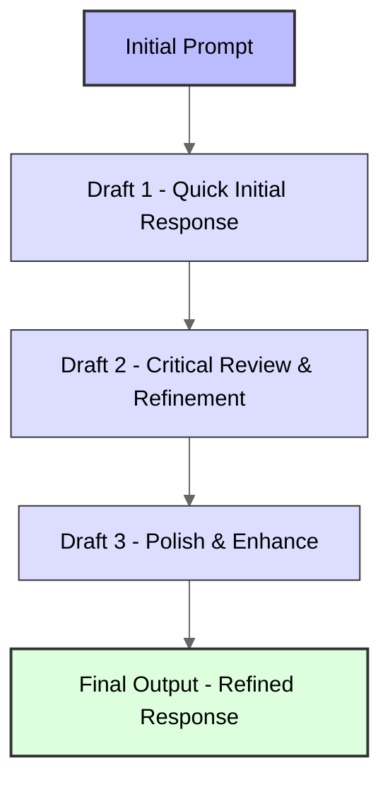
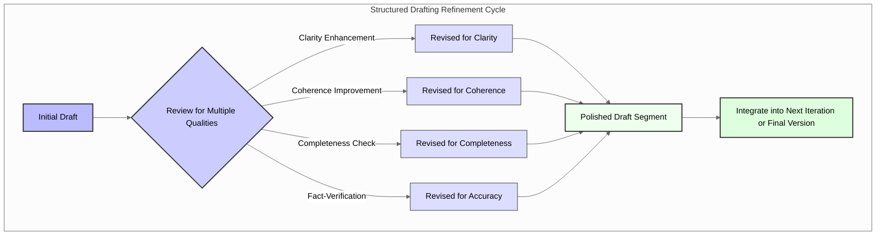

Ever felt your Large Language Model's (LLM) first attempt was... just a starting point? We all know that truly polished writing often comes from revision. This post delves into the **Chain of Draft (CoD)** technique - a powerful approach that mirrors this human-like iterative process to significantly enhance the clarity, depth, and overall quality of LLM-generated text. If you're looking to get more from your models, understanding CoD is key. If you're new to Large Language Models, you might find a primer like [What Are Large Language Models (LLMs)?](https://www.nvidia.com/en-us/glossary/large-language-model/) helpful before diving deeper.

The concept is deceptively simple yet remarkably powerful: instead of generating text in a single pass, the model creates multiple drafts, iteratively refining its output until reaching a polished final version. This approach mimics the human writing process, where we rarely produce our best work on the first attempt.

## The Problem with Traditional Generation Methods

Traditional text generation with LLMs typically follows a straightforward approach - models produce output in a single pass, generating tokens sequentially until completion (a process known as [autoregressive generation](https://en.wikipedia.org/wiki/Autoregressive_model)). While this works reasonably well, it has inherent limitations:

1. Once a token is generated, it becomes fixed and influences all subsequent tokens
2. Models cannot "look ahead" to consider the global structure of the response
3. Early mistakes propagate throughout the entire generation process
4. Complex reasoning tasks often require revision and refinement

Think about your own writing process. Do you typically write a perfect essay, email, or report on your first attempt? Most of us draft, review, and refine our work repeatedly until satisfied with the result.

## The Chain of Draft Methodology

The Chain of Draft approach introduces a paradigm shift in how we leverage LLMs for text generation. Here's how it works:



The process involves multiple stages:

1. **Initial Draft**: The model produces a quick first attempt at responding to the prompt
2. **Critical Review**: The model evaluates its own draft, identifying areas for improvement
3. **Refinement**: Creating improved versions based on self-critique
4. **Finalization**: Producing a polished final output

What's fascinating is that this approach doesn't require any model fine-tuning or architectural changes - it's purely a prompting technique that can be applied to existing LLMs.

## The Science Behind Chain of Draft

The effectiveness of CoD lies in its ability to address several cognitive and computational limitations inherent in standard, single-pass autoregressive text generation. It's not just about trying again; it's about systematically improving through guided iteration.

### Overcoming Local Optimization

Traditional autoregressive generation, where an LLM predicts one word at a time, often falls into the trap of "local optimization." This means the model makes decisions that seem best for the immediate next word or phrase, without a full view of the global structure or overall coherence of the intended response. This can lead to outputs that start strong but meander, lose focus, or fail to address all aspects of a complex prompt. Articles discussing [decoding strategies in LLMs](https://www.invisible.co/blog/how-to-teach-chain-of-thought-reasoning-to-your-llm) often touch upon these greedy approaches and their pitfalls, such as repetition or divergence from the main topic. CoD, by implementing iterative drafting, allows the model to revisit and revise its work holistically. Each draft provides a new, more complete context, enabling the model to make decisions that are better aligned with the global objective, leading to more coherent and well-structured outputs. It's akin to a human writer stepping back to see the bigger picture after completing a section, outlining main arguments first, and then elaborating, rather than just focusing on the current sentence and hoping the overall narrative emerges correctly.

### Self-Critique and Improvement

A cornerstone of CoD is enabling the LLM to engage in a form of self-critique. After producing a draft, the model is prompted to evaluate its own work, identify weaknesses, logical flaws, areas of unclear expression, or stylistic inconsistencies. This capacity for self-reflection and subsequent improvement is a significant step towards more robust AI reasoning. Techniques like those described in [self-correction mechanisms for LLMs](https://learnprompting.org/docs/advanced/self_criticism/introduction), such as self-refinement or chain-of-verification, show that models can be guided to refine their outputs based on identified errors. The CoD framework operationalizes this by making self-critique an integral part of the generation workflow. For example, a draft might be reviewed with a prompt like, "Critique the previous draft for clarity, factual accuracy, and completeness. Identify three key areas for improvement and suggest specific revisions." The subsequent draft then addresses these specific points, leading to a demonstrably better iteration.

### Complexity Management

Many real-world tasks, from writing detailed reports to generating complex code, involve managing a high degree of complexity. CoD allows models to tackle such tasks by breaking them down. The initial draft might serve as a high-level outline or a "skeleton" of the final response. Subsequent drafts can then focus on elaborating individual sections, adding supporting details, incorporating specific data points, and ensuring smooth transitions between ideas. This hierarchical approach to generation is much like how humans manage complex projects - by starting with a broad plan and progressively adding detail. This is particularly beneficial for tasks requiring multi-step reasoning, where each step builds upon the previous one, a concept also explored in [Chain-of-Thought (CoT) prompting](https://www.promptingguide.ai/techniques/chain_of_thought). CoD can be seen as an extension where each "thought" can be an entire draft, iteratively refined. For instance, when generating a comprehensive business plan, the first draft might outline the main sections (Executive Summary, Market Analysis, etc.), the second draft could flesh out each section with key data and projections, and a third draft could refine the language, ensure consistency, and add financial tables. This systematic layering of detail makes complex outputs more manageable and ultimately higher quality.

## Implementation Strategies and Examples

The research into CoD, and community explorations, highlight several effective implementation strategies. These approaches offer different angles on how to guide the iterative drafting process.

### 1. Structured Drafting Process with Refinement Focus

A formal approach involves guiding the model through specific drafting stages, each with a defined purpose for review and refinement. Instead of just generating draft after draft, each iteration can focus on improving particular qualities of the text.



The structured approach typically follows a pattern like this:

```text
Draft 1: Create a rough outline addressing the main points.
Self-Critique 1: Review Draft 1 for logical flow, missing key elements, and overall structure.
Draft 2: Expand the outline based on Self-Critique 1, adding supporting details and examples.
Self-Critique 2: Review Draft 2 for clarity of explanation, strength of examples, and factual accuracy.
Draft 3: Refine the text for advanced clarity, coherence, engagement, and style, incorporating feedback from Self-Critique 2.
Final: Deliver a polished, well-structured response.
```

For more on structuring complex interactions with LLMs, Anthropic's guide on [Chaining Complex Prompts](https://docs.anthropic.com/en/docs/build-with-claude/prompt-engineering/chain-prompts) offers valuable insights into sequencing prompts for better outcomes.

### 2. Mathematical Intuition

From a mathematical perspective, we can conceptualize CoD as an iterative optimization process. If we represent the quality of a generated text as a function $Q(x)$ where $x$ is the generated text, traditional generation attempts to optimize this in a single pass:

$$\hat{x} = \arg\max_x Q(x)$$

CoD instead implements an iterative process:

$$x_{t+1} = \arg\max_x Q(x | x_t)$$

Where $x_t$ represents the draft at iteration $t$. This allows the model to gradually climb the quality landscape rather than attempting to reach the optimum in one leap. The term [$\arg\max$](https://en.wikipedia.org/wiki/Arg_max) refers to finding the input that maximizes the function's output. Each iteration aims to find a better $x$ given the previous state $x_t$.

### 3. Algorithmic View & Technical Details

For those interested in a more concrete technical perspective, the research paper on CoD provides detailed algorithms. The basic algorithm can be represented with the following pseudocode:

```python
def chain_of_draft(prompt, model, num_drafts=3, critique_prompt_template="Review the following draft and provide a revised version {iteration_num}:\n\n{current_draft}"):
    # Initial draft
    current_draft = model.generate(prompt + " Write a first draft:")

    # Iterative refinement
    for i in range(1, num_drafts):
        # Construct a prompt that asks the model to critique and revise the current draft
        refinement_prompt_text = critique_prompt_template.format(iteration_num=i+1, current_draft=current_draft)
        current_draft = model.generate(refinement_prompt_text)

    return current_draft

# Example usage:
# refined_text = chain_of_draft("Explain quantum computing in simple terms.", llm_service, num_drafts=3)
# print(refined_text)
```

This pseudocode illustrates the core loop: generate a draft, then use the model itself (guided by a carefully engineered `critique_prompt_template`) to review and improve it. The original paper explores variations, such as different prompting strategies for the refinement steps (e.g., asking for specific improvements like "make it more concise" or "add more examples") and methods for aggregating feedback if multiple review passes or aspects are considered for each draft.

Key considerations when implementing this include:

- **Prompt Engineering for Refinement:** The quality and specificity of the `critique_prompt_template` are crucial. It must effectively guide the LLM to identify weaknesses and make productive revisions.
- **Number of Drafts:** Finding the optimal `num_drafts` can depend on the complexity of the task and the capabilities of the model. Too few might not yield significant improvement, while too many can lead to diminishing returns and increased computational cost.
- **Computational Cost:** While CoD improves quality, it also increases the computational resources required due to multiple generation steps. Strategies for optimizing this, such as using smaller models for initial drafts or critiques, are areas of ongoing research.

The authors of the CoD paper also discuss the potential integration of this technique with other methods like [Retrieval Augmented Generation (RAG)](https://research.ibm.com/blog/retrieval-augmented-generation-RAG). Using RAG, external knowledge can be fetched and incorporated into the drafting and revision process, potentially improving factual accuracy and depth at each iteration.

### 4. Community Variation: Concise Step-by-Step Drafting

Beyond formal research, the LLM community actively explores and shares practical variations of prompting techniques. One such interesting CoD-like approach, which a user might employ for specific tasks, focuses on extreme conciseness in the intermediate drafting or "thinking" phases:

> "Think step-by-step, but only save a minimal draft for each thinking step, using a maximum of 5 words. Return the answer at the end of the response after the #### separator."

This technique emphasizes brevity in the intermediate "thought" or "draft" steps, aiming for high efficiency and reduced token usage, particularly for tasks where the detailed intermediate steps are more for guiding the model's internal process rather than for human review. The core idea is to capture the essence of each reasoning step without verbosity, culminating in a final, comprehensive answer. This aligns with findings highlighted in articles like "[Chain of Draft: How to Make Your LLM Reasoning More Efficient](https://medium.com/@prateeksikdar/chain-of-draft-how-to-make-your-llm-reasoning-more-efficient-6349f8f23401)" and "[Chain-of-Draft Prompting: A More Efficient Alternative to Chain of Thought](https://www.helicone.ai/blog/chain-of-draft)", which discuss similar "5-word guidelines" and the use of separators for the final output.

This variation can be particularly useful for:

- Tasks where intermediate reasoning steps are primarily for machine processing or internal state tracking, rather than needing to be human-readable at each micro-step.
- Optimizing token count and reducing latency in API calls, especially when dealing with simpler problems or when many such inferences are needed.
- Breaking down relatively straightforward problems where elaborate intermediate drafts are unnecessary, but some step-by-step guidance improves final accuracy.

Let's look at how this might be implemented with prompt examples:

#### Example 1: Simple Arithmetic Problem

```text
User:
John has 5 apples. He buys 3 more and then gives 2 to Jane. How many apples does John have left?
Apply the concise step-by-step drafting: Think step-by-step, but only save a minimal draft for each thinking step, using a maximum of 5 words. Return the answer at the end of the response after the #### separator.

Assistant:
Initial apples: 5.
Buys more: plus 3.
Total before giving: 8.
Gives to Jane: minus 2.
Final count: 6.
####
John has 6 apples left.
```

#### Example 2: Basic Fact Retrieval & Combination

```text
User:
What is the capital of France and what is its main river?
Apply the concise step-by-step drafting: Think step-by-step, but only save a minimal draft for each thinking step, using a maximum of 5 words. Return the answer at the end of the response after the #### separator.

Assistant:
Capital of France: Paris.
Main river in Paris: Seine.
Combine facts for answer.
####
The capital of France is Paris, and its main river is the Seine.
```

These examples illustrate how the LLM is guided to break down the problem into extremely terse intermediate steps before providing the consolidated final answer.

## Experimental Results

The research demonstrates impressive performance improvements across various benchmarks:

| Task Type   | Improvement with CoD |
| ----------- | -------------------- |
| Reasoning   | +12.8%               |
| Writing     | +9.2%                |
| Coding      | +8.7%                |
| Mathematics | +7.5%                |

What's particularly notable is that these improvements were achieved without any model fine-tuning or architectural changes - simply by changing the generation process.

## Key Findings from the Research

1. **Universality**: CoD improves performance across model sizes and architectures
2. **Complementarity**: The technique can be combined with other prompting methods like Chain of Thought
3. **Efficiency**: Despite requiring multiple passes, the overall computation can be optimized to minimize overhead
4. **Scaling**: Benefits increase with model capability - stronger base models show more significant improvements

## Practical Applications

The Chain of Draft technique is not just a theoretical construct; its iterative refinement process offers tangible benefits across a wide spectrum of LLM applications. By enabling models to build upon, critique, and polish their outputs, CoD enhances the quality and reliability of generated text in diverse fields.

### Content Creation

In the realm of content creation - be it for blog posts, marketing copy, scripts, or creative writing - CoD empowers LLMs to produce outputs that are significantly more coherent, engaging, and stylistically polished. Instead of a single, potentially uneven draft, CoD can guide the model to first establish a narrative arc or core message, then flesh it out with compelling details and persuasive language, and finally refine the tone and flow. For instance, an AI writing assistant like those offered by [Jasper](https://www.jasper.ai/) or [Writesonic](https://writesonic.com/) could leverage CoD internally to help users generate higher-quality first drafts of articles by iteratively improving structure, argument strength, and reader engagement, moving far beyond simple sentence completion. This iterative process ensures that the final piece is not only grammatically correct but also strategically effective.

#### Example: Generating a Marketing Email Campaign\*\*

Imagine using CoD to create a 3-email sequence for a new product launch:

- **Prompt to LLM:** "Develop a 3-email marketing campaign for our new productivity app 'TaskMaster Pro'. Goal: Drive sign-ups for a free trial."
- **Draft 1 (LLM):**
  - Email 1: Announce TaskMaster Pro, list features.
  - Email 2: Highlight benefits of features.
  - Email 3: Last call for trial.
- **Self-Critique/Refinement Prompt (Guiding the LLM or done by a human):** "Draft 1 is too feature-focused. Reframe for customer pain points. Subject lines are generic. CTAs need to be stronger. Target audience: busy professionals."
- **Draft 2 (LLM):**
  - Email 1: Subject: "Stop Drowning in Tasks: TaskMaster Pro is Here". Body: Focus on overload, introduce app as solution. CTA: "Try TaskMaster Pro Free".
  - Email 2: Subject: "Reclaim Your Time with TaskMaster Pro". Body: Focus on time-saving benefits with short scenarios. CTA: "Start Your Free Trial Now".
  - Email 3: Subject: "Last Chance: Your Productivity Boost Awaits". Body: Scarcity, reminder of benefits. CTA: "Get TaskMaster Pro - Free Trial Ending Soon".
- **Self-Critique/Refinement Prompt:** "Better, but Email 2 could use a specific testimonial or social proof. Email 3's scarcity is good, maybe add a small bonus for signing up."
- **Draft 3 (LLM):** Incorporates testimonial into Email 2, adds a "bonus e-book on productivity" for trial sign-ups in Email 3. Language polished for a professional yet empathetic tone.
- **Final Output:** A compelling email sequence ready for deployment.

### Technical Documentation

Crafting clear, accurate, and comprehensive technical documentation is a critical but often challenging task, vital for user understanding and product success. CoD's structured approach is exceptionally well-suited for this. An LLM can first generate an outline of a manual or API documentation, covering all essential sections. Subsequent drafts can then elaborate on each function or feature with precise descriptions, provide illustrative code examples, define terminology unambiguously, and ensure logical organization and internal consistency (e.g., ensuring all parameters mentioned are defined). This is particularly valuable for complex systems where missing details or ambiguities can lead to significant user confusion or errors in implementation. AI tools are increasingly used for [technical documentation generation and maintenance](https://addepto.com/blog/ai-for-technical-documentation-how-can-ai-enhance-accuracy-and-conciseness/), and CoD can further enhance their ability to produce user-friendly and maintainable documents by ensuring all facets are covered systematically and reviewed for clarity before finalization, reducing the burden on human technical writers to catch every detail in the first pass.

#### Example: Documenting a New API Endpoint

Suppose we need to document a `/user/{id}/profile` GET endpoint:

- **Prompt to LLM:** "Document the API endpoint GET /user/{id}/profile. It returns user profile data in JSON."
- **Draft 1 (LLM):**
  - **Endpoint:** GET /user/{id}/profile
  - **Description:** Retrieves user profile.
  - **Response:** JSON with user data.
- **Self-Critique/Refinement Prompt:** "Draft 1 lacks crucial details. Add: path parameters, authentication method, possible HTTP status codes (success/errors), example request, and detailed example JSON response with field descriptions."
- **Draft 2 (LLM):**
  - Adds `id` (integer) as path param.
  - Specifies "Authentication: Bearer Token".
  - Lists 200 (Success), 401 (Unauthorized), 404 (Not Found).
  - Includes `curl` example.
  - Provides basic JSON response: `{"name": "John Doe", "email": "john@example.com"}`.
- **Self-Critique/Refinement Prompt:** "JSON response fields need descriptions (e.g., 'name: User's full name', 'email: User's email address'). Clarify data types for each field. Add a note about rate limiting if applicable."
- **Draft 3 (LLM):**
  - Elaborates JSON fields with descriptions and data types (e.g., `name (string)`, `email (string)`).
  - Adds a "Rate Limiting: 100 requests/minute" section.
  - Ensures code examples are correctly formatted.
- **Final Output:** Well-structured, detailed, and developer-friendly API documentation.

### Code Generation

Modern software development often involves intricate planning, precise implementation, and iterative refactoring - a workflow that naturally aligns with the CoD methodology. When tasked with generating code, an LLM using CoD could first produce a high-level algorithmic structure or pseudocode. Subsequent drafts could translate this into a specific programming language, implement detailed logic for each module, and then refine the code for efficiency, readability, and adherence to coding standards. This allows for a more robust approach to AI-assisted programming, reducing the likelihood of bugs that might arise from a single-pass generation and facilitating the creation of more complex software components. Platforms like GitHub Copilot already assist with code, and CoD principles could further enhance their ability to tackle larger, more structured coding tasks.

#### Example: Generating a Python Script for Data Processing

- **Prompt to LLM:** "Write a Python script to read 'input.csv', filter rows where the 'Sales' column (numeric) is greater than 1000, and write the filtered data to 'output.csv'."
- **Draft 1 (LLM):**

  ```python
  import csv
  # Basic script, might miss edge cases
  with open('input.csv', 'r') as infile, open('output.csv', 'w', newline='') as outfile:
      reader = csv.reader(infile)
      writer = csv.writer(outfile)
      header = next(reader)
      writer.writerow(header)
      for row in reader:
          if float(row[header.index('Sales')]) > 1000: # Assumes 'Sales' exists and is convertible
              writer.writerow(row)
  ```

- **Self-Critique/Refinement Prompt:** "Script assumes 'Sales' column exists and is numeric. Add error handling (e.g., for missing column, non-numeric data). Make filenames command-line arguments. Add comments."
- **Draft 2 (LLM):**

  ```python
  import csv
  import argparse
  # Added argparse and basic error check
  parser = argparse.ArgumentParser(description='Filter CSV data.')
  parser.add_argument('infile', help='Input CSV file')
  parser.add_argument('outfile', help='Output CSV file')
  args = parser.parse_args()
  try:
      with open(args.infile, 'r') as infile, open(args.outfile, 'w', newline='') as outfile:
          reader = csv.reader(infile)
          writer = csv.writer(outfile)
          header = next(reader)
          writer.writerow(header)
          sales_idx = header.index('Sales') # Potential ValueError if no 'Sales'
          for row in reader:
              try:
                  if float(row[sales_idx]) > 1000:
                      writer.writerow(row)
              except ValueError:
                  print(f"Skipping row due to non-numeric sales data: {row}") # Basic error log
  except FileNotFoundError:
      print("Error: Input file not found.")
  except ValueError:
      print("Error: 'Sales' column not found in header.")
  ```

- **Self-Critique/Refinement Prompt:** "Error handling is better. Add more specific exception for `sales_idx`. Ensure CSV dialect (delimiter, quotechar) can be handled or is assumed standard. Add docstrings."
- **Draft 3 (LLM):** Includes more robust error handling for column indexing, adds docstrings to explain script function, arguments, and basic usage. May include a note on CSV dialect assumptions.
- **Final Output:** A more robust and user-friendly Python script with basic error handling and command-line arguments.

### Academic Writing

The standards for academic writing are exceptionally high, demanding rigorous argumentation, thorough literature integration, precise language, and meticulous citation. CoD can assist researchers and students by guiding an LLM through the process of drafting research papers, essays, or literature reviews. An initial draft might focus on outlining the core thesis and supporting arguments. Later drafts can integrate evidence from cited sources (potentially combined with RAG techniques to ensure factual grounding from specific scholarly articles), refine the logical flow between sections, and ensure the language meets academic conventions for clarity and objectivity. For example, when writing a literature review, the first draft might list key papers and their main findings. A second draft could synthesize these findings, drawing connections and identifying gaps. A third draft could then polish the language, ensuring proper citation and a coherent narrative. This iterative refinement is crucial for producing scholarly work that withstands peer review and contributes meaningfully to its field. Several [AI tools for academia](https://www.youtube.com/watch?v=IBsBixGTh-I) are emerging, and CoD can be a powerful engine behind them, helping to structure complex arguments and ensure comprehensive coverage of the topic.

#### Example: Drafting a Methodology Section

- **Prompt to LLM:** "Draft a methodology section for a study comparing online learning (OL) vs. traditional classroom (TC) effectiveness on math scores in 8th graders."
- **Draft 1 (LLM):**
  - **Participants:** 8th grade students.
  - **Procedure:** One group OL, one TC. Math test given.
  - **Analysis:** Compare scores.
- **Self-Critique/Refinement Prompt:** "Lacks detail. Specify: sample size, recruitment method, duration of OL/TC intervention, nature of math test (e.g., standardized?), specific statistical test."
- **Draft 2 (LLM):**
  - **Participants:** N=100 8th graders from two schools, recruited via parental consent.
  - **Procedure:** 50 students OL (using Khan Academy for 1 semester), 50 students TC (standard curriculum for 1 semester). Standardized Math Achievement Test (SMAT) administered pre- and post-intervention.
  - **Analysis:** Independent samples t-test on post-intervention SMAT scores, controlling for pre-test scores using ANCOVA.
- **Self-Critique/Refinement Prompt:** "Good. Add details on randomization to groups (if any), ethical considerations (e.g., IRB approval), and how OL/TC content was kept equivalent in terms of topics covered. Clarify data cleaning steps."
- **Draft 3 (LLM):** Adds that students were randomly assigned. Mentions IRB approval obtained. Specifies that curriculum topics were aligned. Notes that outliers will be checked (e.g., +/- 3 SD) and assumptions of ANCOVA (e.g., homogeneity of regression slopes) will be tested.
- **Final Output:** A detailed, methodologically sound section suitable for an academic paper.

## Implementation Example

Here's a simplified example of how you might implement Chain of Draft in a prompt:

```text
User: Explain the concept of neural networks to a high school student.

System: You will generate a response using the Chain of Draft technique. Follow these steps:

1. Draft 1: Create a brief outline of your explanation
2. Draft 2: Expand each point with clear explanations and examples
3. Draft 3: Review and revise for clarity, engagement, and accuracy
4. Final: Deliver the polished explanation

Label each draft clearly, and include your self-critique between drafts.
```

## Limitations and Considerations

While Chain of Draft offers significant benefits, it's important to consider its limitations:

1. **Computational Overhead**: Multiple drafts require additional computation time and token usage, which can be a concern for very long texts or latency-sensitive applications.
2. **Potential for Repetition**: Without careful prompting for novelty in each draft, models may sometimes repeat content or get stuck in refinement loops that don't add substantial value.
3. **Implementation Complexity**: Effectively managing the drafting process, especially the self-critique prompts, requires careful prompt design and potentially custom infrastructures or orchestration for production use.
4. **Quality of Critique**: The effectiveness of CoD heavily relies on the LLM's ability to generate useful critiques of its own work. If the critique mechanism is weak, the refinement might be suboptimal.

## Future Directions

The research into Chain of Draft and iterative refinement techniques is ongoing and vibrant, suggesting several promising future directions:

1. **Specialized Drafting Strategies**: Developing domain-specific drafting and critique approaches tailored for particular types of content, like legal documents, scientific papers, or specific coding languages.
2. **Hybrid Human-AI Workflows**: Creating more seamless ways to integrate human feedback and expertise at specific points within the automated drafting cycle, allowing for human oversight where it's most impactful.
3. **Automated Drafting Management**: Designing intelligent systems that can dynamically determine the optimal number of drafts or the best critique strategy based on the complexity of the task and the evolving quality of the text.
4. **Multi-modal Drafting**: Extending the principles of CoD beyond text to the generation and refinement of images, audio, video, and other forms of media.
5. **Optimizing Efficiency**: Research into making the multi-pass process more computationally efficient, perhaps by using smaller, specialized models for critique or by selectively re-generating only parts of a draft.

## Conclusion

Chain of Draft represents a significant and intuitive advancement in how we can leverage the power of large language models. By emulating the human writing process of iterative drafting, critical review, and thoughtful revision, CoD allows us to guide LLMs toward producing text that is not only more accurate and coherent but also more nuanced and fit for purpose. Its simplicity from a conceptual standpoint, combined with its effectiveness across various tasks and its versatility, makes it an invaluable technique for anyone serious about working with language models to achieve high-quality outputs.

As this field continues to evolve, implementing such iterative approaches will be key to pushing the capabilities of existing models further, enabling more complex and reliable AI-generated content without solely waiting for the next generation of larger, more computationally intensive architectures. The ability to refine, self-correct, and build upon previous attempts is a hallmark of advanced reasoning, and CoD brings LLMs a step closer to that ideal.

---

## References

1. Tian, J., & Liu, Y. (2024). _Chain of Draft: An Iterative Approach for LLM Text Generation_. arXiv:2502.18600. ([Link to paper](https://arxiv.org/abs/2502.18600))
2. Nvidia. (n.d.). _What Are Large Language Models (LLMs)?_ Retrieved May 20, 2025, from [https://www.nvidia.com/en-us/glossary/large-language-model/](https://www.nvidia.com/en-us/glossary/large-language-model/)
3. Wikipedia contributors. (n.d.). _Autoregressive model_. Wikipedia, The Free Encyclopedia. Retrieved May 20, 2025, from [https://en.wikipedia.org/wiki/Autoregressive_model](https://en.wikipedia.org/wiki/Autoregressive_model)
4. Anthropic. (n.d.). _Chaining Complex Prompts_. Anthropic Documentation. Retrieved May 20, 2025, from [https://docs.anthropic.com/en/docs/build-with-claude/prompt-engineering/chain-prompts](https://docs.anthropic.com/en/docs/build-with-claude/prompt-engineering/chain-prompts)
5. Wikipedia contributors. (n.d.). _Arg max_. Wikipedia, The Free Encyclopedia. Retrieved May 20, 2025, from [https://en.wikipedia.org/wiki/Arg_max](https://en.wikipedia.org/wiki/Arg_max)
6. IBM Research. (n.d.). _Retrieval Augmented Generation (RAG)_. IBM Research Blog. Retrieved May 20, 2025, from [https://research.ibm.com/blog/retrieval-augmented-generation-RAG](https://research.ibm.com/blog/retrieval-augmented-generation-RAG)
7. Sikdar, P. (2023, October 20). _Chain of Draft: How to Make Your LLM Reasoning More Efficient_. Medium. Retrieved May 20, 2025, from [https://medium.com/@prateeksikdar/chain-of-draft-how-to-make-your-llm-reasoning-more-efficient-6349f8f23401](https://medium.com/@prateeksikdar/chain-of-draft-how-to-make-your-llm-reasoning-more-efficient-6349f8f23401)
8. Helicone. (n.d.). _Chain-of-Draft Prompting: A More Efficient Alternative to Chain of Thought_. Helicone Blog. Retrieved May 20, 2025, from [https://www.helicone.ai/blog/chain-of-draft](https://www.helicone.ai/blog/chain-of-draft)
9. Invisible Technologies. (2025, April 1). _How to teach chain of thought reasoning to your LLM_. Invisible Technologies Blog. Retrieved May 20, 2025, from [https://www.invisible.co/blog/how-to-teach-chain-of-thought-reasoning-to-your-llm](https://www.invisible.co/blog/how-to-teach-chain-of-thought-reasoning-to-your-llm)
10. Learn Prompting. (n.d.). _Introduction to Self-Criticism Prompting Techniques_. Learn Prompting Documentation. Retrieved May 20, 2025, from [https://learnprompting.org/docs/advanced/self_criticism/introduction](https://learnprompting.org/docs/advanced/self_criticism/introduction)
11. Prompting Guide. (n.d.). _Chain-of-Thought Prompting_. Prompting Guide. Retrieved May 20, 2025, from [https://www.promptingguide.ai/techniques/chain_of_thought](https://www.promptingguide.ai/techniques/chain_of_thought)
12. Addepto. (2024, October 29). _AI For Technical Documentation. How Can AI Enhance Accuracy And Conciseness?_ Addepto Blog. Retrieved May 20, 2025, from [https://addepto.com/blog/ai-for-technical-documentation-how-can-ai-enhance-accuracy-and-conciseness/](https://addepto.com/blog/ai-for-technical-documentation-how-can-ai-enhance-accuracy-and-conciseness/)
13. The AI Advantage (Director). (2025, January 15). _The Best AI Tools for Academia in 2025 - Stop Searching ..._ [Video file]. YouTube. Retrieved May 20, 2025, from [https://www.youtube.com/watch?v=IBsBixGTh-I](https://www.youtube.com/watch?v=IBsBixGTh-I)

---
