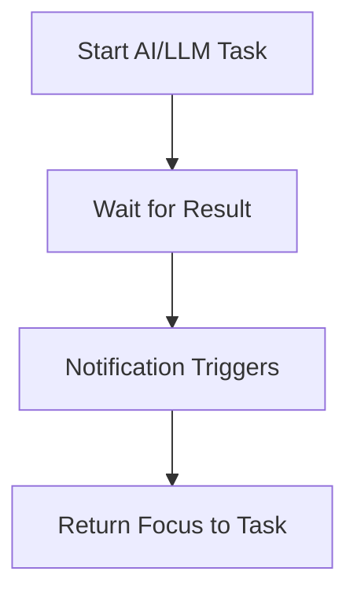

## How to Stay Focused When Working with AI

> **TL;DR:** If you want to optimize your workflow and maintain focus while working with AI or LLM tasks, use notifications and automation to bring your attention back at the right moment. Here's how I approach this, with practical examples for Jupyter, macOS, and more.

## Ever Launched an AI Task and Wondered, "Now What?"

You kick off a long-running AI job, grab a coffee, maybe check your email, and before you know it, you've forgotten all about the task you started. I've been there—and I wanted a smarter, more efficient way to keep my workflow moving without missing a beat.

## The Opportunity: Optimizing Focus When Working with AI

When working with AI and LLMs, I'm often running multiple projects and long-running tasks. Rather than waiting idly or risking missed results, I look for ways to automate notifications and streamline my workflow. Proactive automation helps me stay efficient and maintain momentum across all my work.

## The Drive for Automation

I'm always seeking smarter ways to stay in the flow and avoid unnecessary context switching. System notifications and simple automation scripts are a key part of my toolkit for keeping my attention where it matters most.

## The Solution: Step-by-Step Automation

### Example for macOS (Python + AppleScript Notification)

This code sends a native notification on macOS using Python and AppleScript

```python
import subprocess
subprocess.run([
    'osascript', '-e',
    'display notification with title "Task Complete" subtitle "ProjectX" sound name "Glass"'
])
```

### Example for macOS (Voice Notification)

This code makes your Mac speak a custom message

```python
import os
os.system('say "Your data is ready!"')
```



> **Note:** These methods work only on your local machine. If you're connected to a remote server, notifications won't appear.

**Why AppleScript?**

- macOS does not provide a direct Python API for notifications.
- AppleScript is the native way to trigger system notifications, and calling it from Python is a best practice for this OS.
- For cross-platform notifications, consider:
  - **Linux:** Use `notify-send` via `subprocess`.
  - **Windows:** Use Python packages like `win10toast`.
  - **macOS:** You can also use third-party Python packages like `pync`, which wrap AppleScript.

## Quick Comparison: Notification Methods by OS

| OS      | Native Method       | Python Example/Package       |
| ------- | ------------------- | ---------------------------- |
| macOS   | AppleScript         | subprocess + osascript, pync |
| Linux   | notify-send         | subprocess + notify-send     |
| Windows | Toast Notifications | win10toast                   |

## Practical Tips

- Use notifications for any long-running computations or AI requests.
- In Jupyter notebooks, add a notification at the end of a cell with long-running code.
- For Windows and Linux, try alternatives like notify-send for Linux or win10toast for Windows.
- Experiment with different ways to regain focus: sounds, pop-ups, emails.
- Choose notification methods that work with your accessibility tools (e.g., screen readers).

## Troubleshooting & FAQ

**Q: My notifications aren't showing up—what should I check?**  
A: Make sure you're running the script locally, not on a remote server. For Linux, ensure `notify-send` is installed. For Windows, check that notifications are enabled in system settings.

**Q: Can I customize the notification sound or message?**  
A: Yes! Edit the AppleScript or Python string to change the title, subtitle, or sound.

**Q: Are there alternatives for Jupyter running in the cloud?**  
A: Consider using email notifications, Slack integrations, or browser-based notification extensions.

## Next Steps: Advanced Automation

Want to automate even more? Try integrating notifications with Slack, email, or mobile push services for cross-device alerts.

## Resources and Links

- [Jupyter Documentation](https://jupyter.org/documentation)
- [notify-send (Linux)](https://specifications.freedesktop.org/notification-spec/latest/)
- [win10toast (Windows)](https://pypi.org/project/win10toast/)
- [pync (macOS)](https://github.com/setem/pync)

## Conclusion: Your Turn

A small automation can make a big difference in productivity and focus. Try these techniques, adapt them to your workflow, and share your own hacks or questions in the comments. What's your favorite way to stay focused while your code runs?
