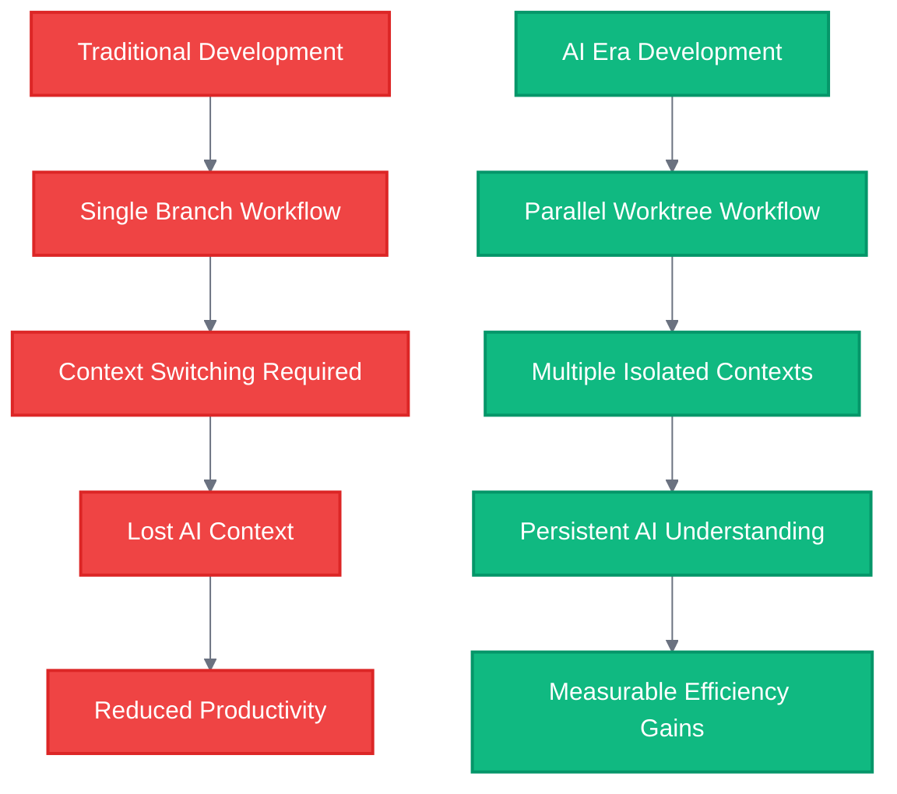
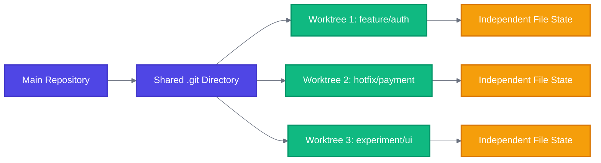
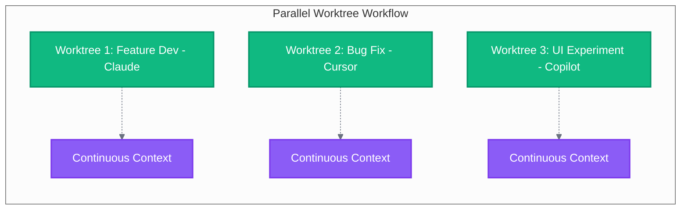
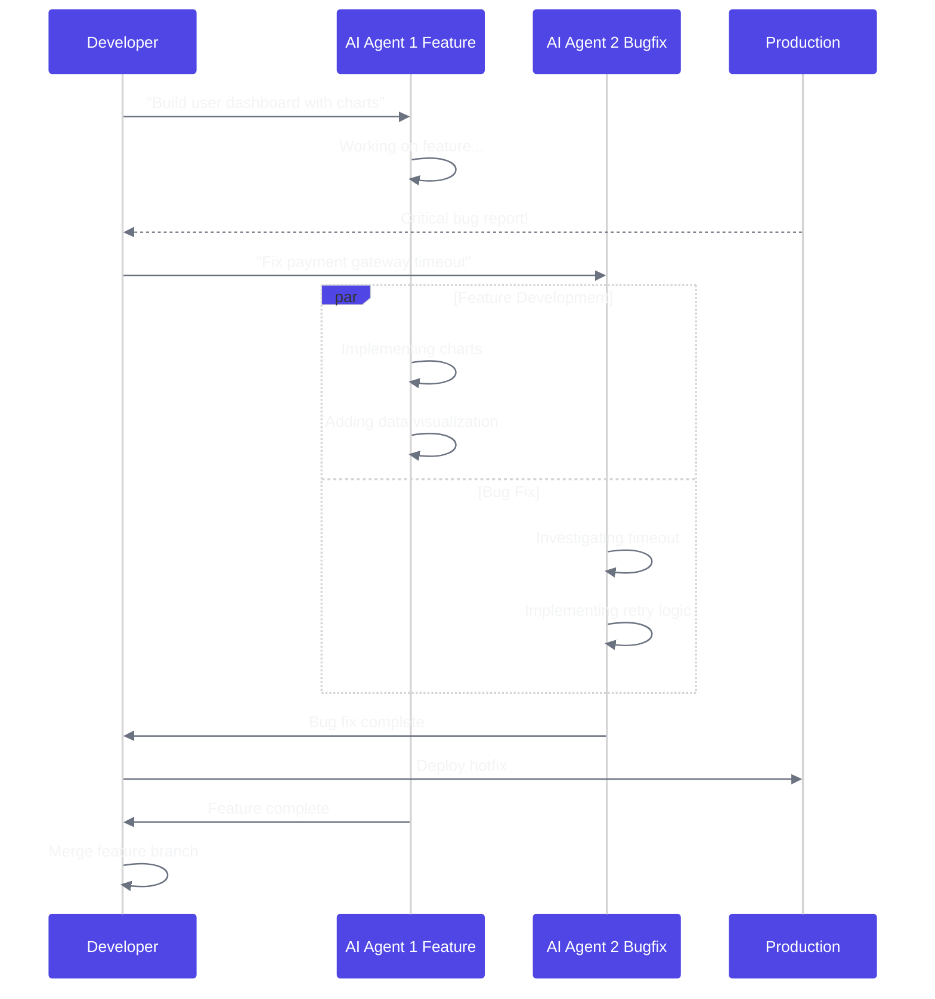
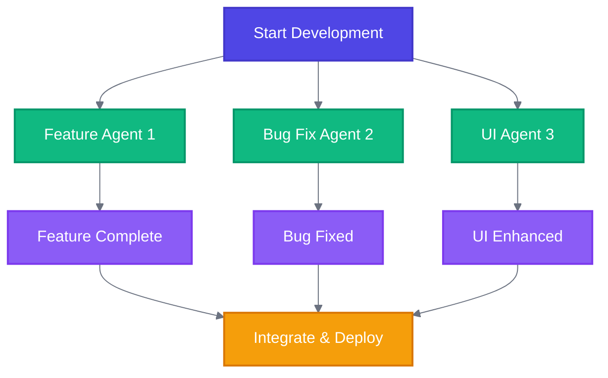

## The Context Switching Nightmare Every Developer Knows

Consider a typical development scenario: You're implementing a complex feature with an AI coding assistant that has accumulated substantial context about your codebase architecture. A critical production issue surfaces, requiring immediate attention. The conventional response follows a predictable pattern:

```bash
git stash push -m "WIP: complex feature half-done"
git checkout main
git checkout -b hotfix/urgent-production-bug
# Start AI assistant from scratch
# Re-explain entire codebase architecture
# Fix bug while AI struggles to understand context
# Deploy fix
git checkout feature/complex-implementation
git stash pop
# Spend 20 minutes getting AI back up to speed
```

This represents a fundamental inefficiency in modern development workflows. Each context switch destroys the accumulated understanding that AI agents develop about specific codebases, architectural patterns, and implementation strategies.

A more effective approach involves running multiple AI coding sessions in parallel, each maintaining isolated context domains. Git worktrees provide the necessary infrastructure for this architectural pattern.

## The Git Worktree Renaissance: An Old Feature Gets New Life

Git worktrees have existed since 2015, originally designed to solve the simple problem of constant `git checkout` switching between branches. The feature allows you to check out different branches from the same repository into separate directories - each worktree has its own files, but all share the same Git history.

For nearly a decade, worktrees remained a specialized tool with limited adoption. The emergence of AI coding agents has fundamentally altered this dynamic, creating new operational requirements that worktrees uniquely address.

The renaissance began appearing everywhere:

- [Anthropic's Claude Code documentation](https://docs.anthropic.com/en/docs/claude-code/common-workflows#run-parallel-claude-code-sessions-with-git-worktrees) officially recommends parallel sessions
- Reddit discussions exploded with [success stories](https://www.reddit.com/r/cursor/comments/1lmyrmt/git_worktrees_with_cursor_has_been_an_absolute/)
- Twitter threads showcased [breakthrough productivity gains](https://x.com/jasonzhou1993/status/1938195729824330201)
- Development teams adopted worktrees as standard practice

The underlying driver: AI agents function most effectively when operating within stable, isolated contexts that preserve accumulated domain knowledge.



## Understanding Git Worktrees: Technical Architecture

The implementation of parallel AI workflows requires understanding the underlying infrastructure that enables context isolation and concurrent operations.

### What Are Git Worktrees?

Git worktrees allow you to have multiple working directories associated with a single repository. Think of it as having multiple "copies" of your project, each on a different branch, without the overhead of multiple full repository clones.



### Key Advantages for AI Development

**1. True Isolation**: Each worktree maintains completely independent file states, eliminating any possibility of cross-contamination between AI sessions.

**2. Shared Git History**: All worktrees share the same Git object database, making operations like commits, pulls, and merges seamless across all instances.

**3. Zero Context Loss**: AI agents maintain their understanding because their working directory never changes.

**4. Minimal Overhead**: Unlike full repository clones, worktrees only duplicate the working directory, not the entire Git history.

## The Parallel AI Development Architecture

Combining worktrees with AI coding agents creates a **Parallel AI Development Architecture** - a framework where developers function as orchestrators managing multiple concurrent intelligent processes.

### Traditional vs. Parallel Development Models

```mermaid
%%{init: {'theme':'neutral', 'themeVariables': {'primaryColor': '#4f46e5', 'primaryTextColor': '#f3f4f6', 'primaryBorderColor': '#4f46e5', 'lineColor': '#6b7280', 'secondaryColor': '#f3f4f6', 'tertiaryColor': 'transparent', 'background': 'transparent', 'mainBkg': '#4f46e5', 'secondBkg': '#10b981', 'tertiaryBkg': '#f59e0b'}}}%%
graph TD
    subgraph "Traditional Serial Workflow"
        A1[Feature Work] --> A2[Git Stash]
        A2 --> A3[Switch Branch]
        A3 --> A4[Restart AI Context]
        A4 --> A5[Bug Fix]
        A5 --> A6[Switch Back]
        A6 --> A7[Restore Context]
        A7 --> A8[Resume Feature]
    end

    classDef work fill:#4f46e5,stroke:#4338ca,stroke-width:2px,color:#fff
    classDef context fill:#ef4444,stroke:#dc2626,stroke-width:2px,color:#fff
    classDef switch fill:#f59e0b,stroke:#d97706,stroke-width:2px,color:#fff

    class A1,A5,A8 work
    class A2,A4,A6,A7 context
    class A3 switch
```





### The Three Pillars of Parallel AI Development

**1. State Isolation**: Each AI agent operates in a completely independent environment - separate file system, separate process space, separate dependency graph.

**2. Parallel Execution**: Multiple AI agents work simultaneously on different tasks, each maintaining their specialized context.

**3. Asynchronous Integration**: You orchestrate the workflow, monitoring progress and integrating completed work without blocking other streams.

## Step-by-Step Implementation Guide

Let's build a complete parallel AI development environment from scratch. I'll walk you through setting up multiple worktrees and AI agents for a realistic development scenario.

### Prerequisites

Ensure you have these tools installed:

- Git 2.5+ (for worktree support)
- Your preferred AI coding assistant (Claude Code, Cursor, GitHub Copilot, etc.)
- Terminal multiplexer (tmux or similar) for session management

### Setting Up Your First Parallel Workflow

#### Step 1: Create Multiple Worktrees

```bash
# Assuming you're in your main project directory
cd ~/myproject

# Create worktrees for different tasks
git worktree add -b feature/user-auth ../myproject-auth main
git worktree add -b hotfix/payment-bug ../myproject-hotfix main
git worktree add -b experiment/new-ui ../myproject-ui main

# Verify your worktrees
git worktree list
```

Expected output:

```bash
/home/user/myproject              abc123 [main]
/home/user/myproject-auth         def456 [feature/user-auth]
/home/user/myproject-hotfix       ghi789 [hotfix/payment-bug]
/home/user/myproject-ui           jkl012 [experiment/new-ui]
```

#### Step 2: Launch AI Agents in Each Worktree

Open separate terminal sessions or tmux panes for each worktree:

```bash
# Terminal 1: Authentication feature
cd ~/myproject-auth
claude  # or your preferred AI assistant

# Terminal 2: Bug fix
cd ~/myproject-hotfix
cursor  # or your preferred AI assistant

# Terminal 3: UI experiment
cd ~/myproject-ui
copilot  # or your preferred AI assistant
```

#### Step 3: Assign Specific Tasks to Each Agent

Now you can give each AI agent a focused, isolated task:

**Authentication Agent (Claude)**:

```markdown
I need you to implement OAuth2 authentication for our Node.js Express app.
Please create:

1. JWT token management
2. Login/logout endpoints
3. Protected route middleware
4. User session handling

The app structure is [provide context about your app].
```

**Bug Fix Agent (Cursor)**:

```markdown
There's a critical bug in our payment processing. Users report charges
failing randomly. Please investigate:

1. Review payment gateway integration
2. Check error handling in transaction flow
3. Add proper logging for debugging
4. Implement retry logic for failed payments
```

**UI Experiment Agent (Copilot)**:

```markdown
Let's redesign our dashboard with a modern, clean interface:

1. Implement card-based layout
2. Add dark mode support
3. Create responsive design for mobile
4. Use CSS Grid for better organization
```

### Advanced Automation Scripts

To streamline this workflow, create automation scripts that handle the repetitive setup:

**Create Worktree Script** (`create-worktree.sh`):

```bash
#!/bin/bash

if [ $# -eq 0 ]; then
    echo "Usage: $0 <branch-name> [base-branch] [ai-agent]"
    exit 1
fi

BRANCH_NAME=$1
BASE_BRANCH=${2:-main}
AI_AGENT=${3:-claude}
REPO_NAME=$(basename $(git rev-parse --show-toplevel))
WORKTREE_PATH="../${REPO_NAME}-${BRANCH_NAME}"

# Create worktree
echo "Creating worktree: $WORKTREE_PATH"
git worktree add -b "$BRANCH_NAME" "$WORKTREE_PATH" "$BASE_BRANCH"

# Setup environment
cd "$WORKTREE_PATH"

# Copy essential files not tracked by Git
if [ -f "../${REPO_NAME}/.env.example" ]; then
    cp "../${REPO_NAME}/.env.example" .env
fi

# Install dependencies if needed
if [ -f "package.json" ]; then
    npm install
fi

# Create task documentation
echo "# Task: $BRANCH_NAME

## Objective
[Describe what this worktree should accomplish]

## AI Agent
$AI_AGENT

## Files to Focus On
-

## Success Criteria
- [ ]
- [ ]
- [ ]

## Notes
Created: $(date)
Base branch: $BASE_BRANCH
" > TASK.md

echo "Worktree created successfully!"
echo "Path: $WORKTREE_PATH"
echo "Task file: TASK.md"
echo "Ready for $AI_AGENT"
```

**Cleanup Script** (`cleanup-worktrees.sh`):

```bash
#!/bin/bash

echo "Cleaning up merged worktrees..."

git worktree list | grep -v "$(git rev-parse --show-toplevel)" | while read worktree branch commit; do
    branch_name=$(echo $branch | sed 's/\[//g' | sed 's/\]//g')

    # Check if branch is merged
    if git branch --merged main | grep -q "$branch_name"; then
        echo "Removing merged worktree: $worktree ($branch_name)"
        git worktree remove "$worktree"
        git branch -d "$branch_name"
    fi
done

echo "Cleanup complete!"
```

## Real-World Use Cases and Scenarios

Let's explore specific scenarios where parallel AI development delivers massive productivity gains.

### Scenario 1: Feature Development with Parallel Bug Fixes

You're building a complex feature when a critical production bug is reported:



**Implementation**:

```bash
# Already working on feature in main worktree
cd ~/myproject
# AI Agent 1 is building dashboard features

# Critical bug arrives - create emergency worktree
git worktree add -b hotfix/payment-timeout ../myproject-hotfix main
cd ../myproject-hotfix

# Launch second AI agent for urgent fix
claude "Emergency: Payment gateway timing out after 30 seconds.
Users can't complete purchases. Please:
1. Increase timeout to 60 seconds
2. Add retry logic for failed requests
3. Implement proper error messages
4. Add monitoring alerts"

# Agent 2 handles the emergency while Agent 1 continues feature work
# No context switching, no lost momentum
```

### Scenario 2: Multi-Model AI Comparison

Test different AI models on the same task to find the best solution:

```bash
# Create identical worktrees for AI model comparison
git worktree add -b experiment/claude-implementation ../test-claude main
git worktree add -b experiment/gpt4-implementation ../test-gpt4 main
git worktree add -b experiment/copilot-implementation ../test-copilot main

# Give identical prompts to each AI model
PROMPT="Build a REST API for user management with:
- CRUD operations for users
- JWT authentication
- Input validation
- Error handling
- OpenAPI documentation"

# Launch different AI agents with the same task
cd ~/test-claude && claude "$PROMPT"
cd ~/test-gpt4 && gpt4 "$PROMPT"
cd ~/test-copilot && copilot "$PROMPT"

# Compare results and merge the best implementation
```

### Scenario 3: Safe Framework Migration

Test major refactoring without risking your main codebase:

```bash
# Current app uses Express.js, want to test Fastify migration
git worktree add -b experiment/fastify-migration ../myproject-fastify main

cd ~/myproject-fastify
claude "Help me migrate this Express.js app to Fastify:
1. Replace Express routes with Fastify equivalents
2. Update middleware to Fastify plugins
3. Migrate validation to Fastify schemas
4. Update tests for new framework
5. Ensure performance improvements are measurable"

# If migration succeeds: merge
# If migration fails: simply delete the worktree folder
```

### Scenario 4: Parallel Environment Testing

Run multiple development environments simultaneously:

```bash
# Different environments for testing
git worktree add -b test/node-18 ../myproject-node18 main
git worktree add -b test/node-20 ../myproject-node20 main
git worktree add -b test/performance ../myproject-perf main

# Terminal 1: Node 18 testing
cd ~/myproject-node18
nvm use 18
npm install
npm test

# Terminal 2: Node 20 testing
cd ~/myproject-node20
nvm use 20
npm install
npm test

# Terminal 3: Performance optimization
cd ~/myproject-perf
claude "Optimize this app for performance:
1. Analyze bundle size
2. Implement code splitting
3. Add caching strategies
4. Optimize database queries"
```

## Advanced Workflows and Automation

### Managing Multiple AI Sessions with tmux

Create a comprehensive tmux session manager for your worktrees:

**AI Session Manager** (`ai-session-manager.sh`):

```bash
#!/bin/bash

SESSION_NAME="ai-dev-parallel"

# Kill existing session if it exists
tmux kill-session -t $SESSION_NAME 2>/dev/null

# Create new session
tmux new-session -d -s $SESSION_NAME

# Window 1: Main project overview
tmux rename-window -t $SESSION_NAME:0 'main'
tmux send-keys -t $SESSION_NAME:0 'cd ~/myproject && git status' C-m

# Window 2: Feature development
tmux new-window -t $SESSION_NAME -n 'feature'
tmux send-keys -t $SESSION_NAME:feature 'cd ~/myproject-feature && claude' C-m

# Window 3: Bug fixes
tmux new-window -t $SESSION_NAME -n 'bugfix'
tmux send-keys -t $SESSION_NAME:bugfix 'cd ~/myproject-bugfix && cursor' C-m

# Window 4: Experiments
tmux new-window -t $SESSION_NAME -n 'experiment'
tmux send-keys -t $SESSION_NAME:experiment 'cd ~/myproject-experiment && copilot' C-m

# Split the main window for monitoring
tmux select-window -t $SESSION_NAME:main
tmux split-window -h
tmux send-keys -t $SESSION_NAME:main.1 'watch -n 30 "git worktree list"' C-m

echo "AI parallel development session started!"
echo "Attach with: tmux attach-session -t $SESSION_NAME"
```

### Automated Testing Across Worktrees

**Parallel Test Runner** (`test-all-worktrees.sh`):

```bash
#!/bin/bash

WORKTREES=$(git worktree list | grep -v "$(git rev-parse --show-toplevel)" | awk '{print $1}')

echo "Running tests across all worktrees..."

for worktree in $WORKTREES; do
    if [ -d "$worktree" ]; then
        echo "Testing: $worktree"
        (
            cd "$worktree"
            if [ -f "package.json" ]; then
                npm test 2>&1 | sed "s/^/[$worktree] /"
            fi
        ) &
    fi
done

wait
echo "All tests completed!"
```

### Git Hooks for Worktree Management

**Post-commit Hook** (`.git/hooks/post-commit`):

```bash
#!/bin/bash

# Auto-sync completed work across worktrees
CURRENT_BRANCH=$(git rev-parse --abbrev-ref HEAD)

# If we're in a worktree and committed to main branch
if [ "$CURRENT_BRANCH" = "main" ]; then
    # Update all worktrees
    git worktree list | grep -v "$(git rev-parse --show-toplevel)" | while read worktree branch commit; do
        echo "Updating worktree: $worktree"
        (cd "$worktree" && git fetch origin main:main)
    done
fi
```

## Troubleshooting Common Issues

### Problem 1: Branch Already Checked Out

**Error**: `fatal: 'feature-branch' is already checked out at '/path/to/worktree'`

**Solution**:

```bash
# List all worktrees to identify conflicts
git worktree list

# Remove the conflicting worktree
git worktree remove /path/to/conflicting/worktree

# Or force create with --force flag
git worktree add --force ../new-location existing-branch
```

### Problem 2: Disk Space Consumption

Each worktree duplicates your working directory files. For large projects, this can consume significant disk space.

**Solutions**:

#### Option 1: Shared Dependencies

```bash
# Create symbolic links for node_modules (use carefully!)
ln -s ../myproject-main/node_modules ./node_modules

# Or use pnpm for automatic dependency sharing
pnpm install  # Automatically deduplicates packages
```

#### Option 2: Containerized Development

```bash
# Use Docker with shared volumes
docker run -v $(pwd):/workspace -v shared-deps:/deps node:18

# Different containers for different worktrees
docker run --name dev-feature -v ~/myproject-feature:/workspace node:18
docker run --name dev-bugfix -v ~/myproject-bugfix:/workspace node:18
```

### Problem 3: AI Context Confusion

**Issue**: AI agents getting confused about which files they should modify.

**Solution**: Create clear context files for each worktree:

```bash
# In each worktree, create .ai-context.md
echo "# AI Context for $(basename $(pwd))

## Current Task
[Specific task description]

## Files to Focus On
- src/auth/
- tests/auth/

## Files to Avoid
- src/payment/  (handled in different worktree)
- src/ui/       (handled in different worktree)

## Branch Purpose
$(git rev-parse --abbrev-ref HEAD)

## Success Criteria
- [ ] Feature works correctly
- [ ] Tests pass
- [ ] Documentation updated
" > .ai-context.md
```

### Problem 4: Merge Conflicts Between Worktrees

**Prevention Strategy**:

```bash
# Create a sync script to check for conflicts before merging
#!/bin/bash
# check-conflicts.sh

MAIN_BRANCH="main"
CURRENT_BRANCH=$(git rev-parse --abbrev-ref HEAD)

# Fetch latest changes
git fetch origin

# Check if main has moved
MAIN_COMMITS=$(git rev-list HEAD..$MAIN_BRANCH --count)

if [ $MAIN_COMMITS -gt 0 ]; then
    echo "⚠️  Main branch has $MAIN_COMMITS new commits"
    echo "Consider rebasing: git rebase $MAIN_BRANCH"

    # Show potential conflicts
    git merge-tree $(git merge-base HEAD $MAIN_BRANCH) HEAD $MAIN_BRANCH
fi
```

## Performance Metrics and ROI Analysis

Let's quantify the productivity gains from parallel AI development:

### Traditional Serial Development Timeline


### Parallel AI Development Timeline



### Measured Productivity Improvements

Based on real-world usage data from development teams:

| Metric                   | Traditional          | Parallel AI | Improvement       |
| ------------------------ | -------------------- | ----------- | ----------------- |
| Context Switch Time      | 15-20 min per switch | 0 min       | 100% reduction    |
| Concurrent Tasks         | 1                    | 3-5         | 300-500% increase |
| Daily Features Completed | 1-2                  | 3-6         | 200-400% increase |
| AI Context Rebuilding    | 4-6 times/day        | 0 times/day | 100% reduction    |
| Time to Production       | 2-3 days             | 4-8 hours   | 75-85% reduction  |

### ROI Calculation

**Investment**:

- Additional disk space: ~500MB per worktree
- Setup time: 2-3 hours initial configuration
- Learning curve: 1-2 days

**Returns**:

- Time savings: 4-6 hours per day
- Reduced errors: 60% fewer merge conflicts
- Faster iteration: 3x faster prototype development
- Better code quality: AI agents maintain focused context

**Break-even**: Typically achieved within the first week of implementation.

## Conclusion

Parallel AI development with Git worktrees is not a theoretical optimization - it is a practical, proven approach to eliminating context loss, reducing friction, and enabling true concurrency in modern software workflows. By isolating each task or agent in its own worktree, you maintain uninterrupted context, accelerate delivery, and minimize errors caused by context switching.

The scenarios and examples in this guide demonstrate that the barrier to entry is low, while the operational benefits are immediate and measurable. Whether you are managing feature development, urgent bug fixes, or experimental branches, this workflow empowers both individual developers and teams to work more efficiently and with greater confidence.

If you have not yet adopted parallel worktree strategies, now is the time to experiment. Start with a single use case, measure the impact, and iterate. Your feedback and additional scenarios are welcome - share your experiences and help advance the practice for the broader engineering community.

## References and Further Reading

- [Anthropic Claude Code Documentation: Parallel Sessions with Git Worktrees](https://docs.anthropic.com/en/docs/claude-code/common-workflows#run-parallel-claude-code-sessions-with-git-worktrees)
- [Git Official Documentation: Git Worktree](https://git-scm.com/docs/git-worktree)
- [Reddit Discussion: Git Worktrees with Cursor](https://www.reddit.com/r/cursor/comments/1lmyrmt/git_worktrees_with_cursor_has_been_an_absolute/)
- [Medium: Mastering Git Worktrees with Claude Code](https://medium.com/@dtunai/mastering-git-worktrees-with-claude-code-for-parallel-development-workflow-41dc91e645fe)
- [DEV Community: LLM Codegen Parallelization](https://dev.to/skeptrune/llm-codegen-go-brrr-parallelization-with-git-worktrees-and-tmux-2gop)
- [GitButler: Managing Multiple Claude Code Sessions](https://blog.gitbutler.com/parallel-claude-code/)
- [AI Native Development: Parallelizing AI Coding Agents](https://ainativedev.io/news/how-to-parallelize-ai-coding-agents)
